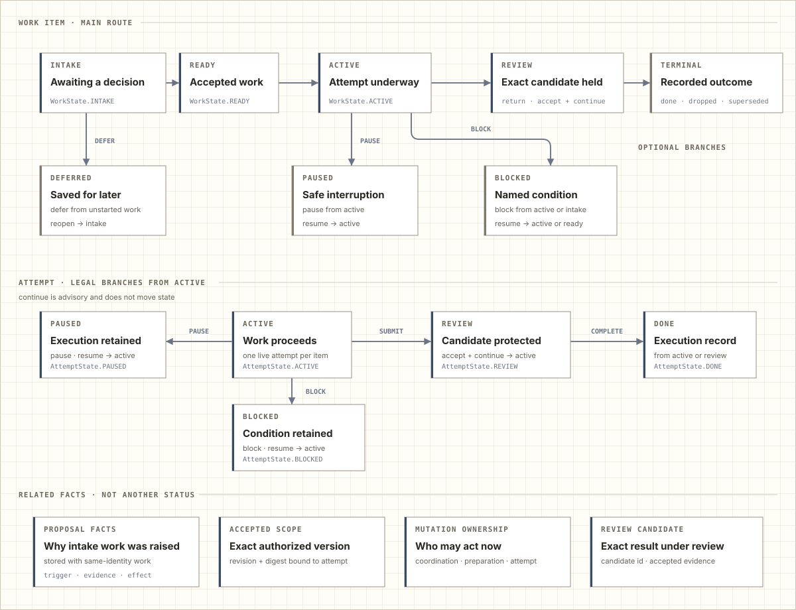
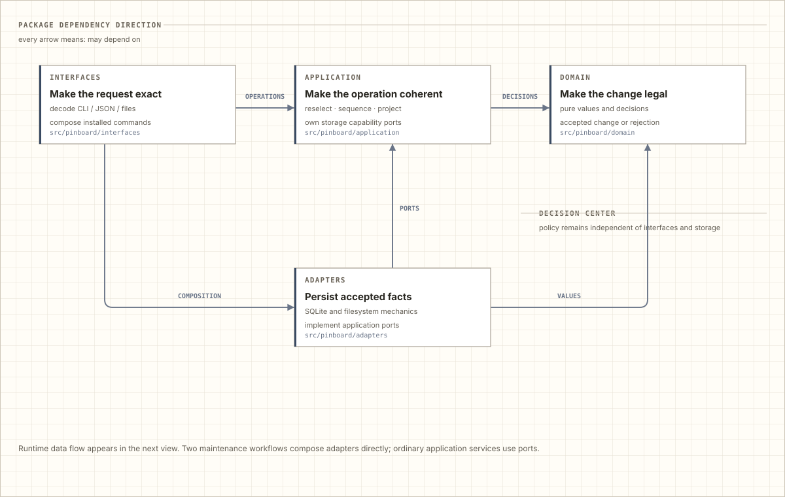
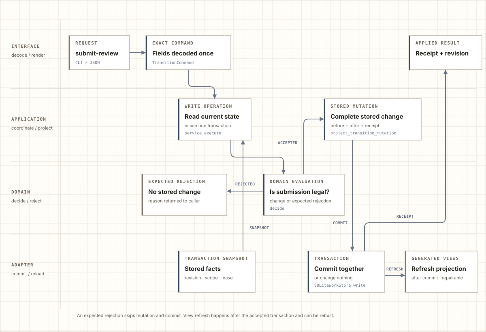
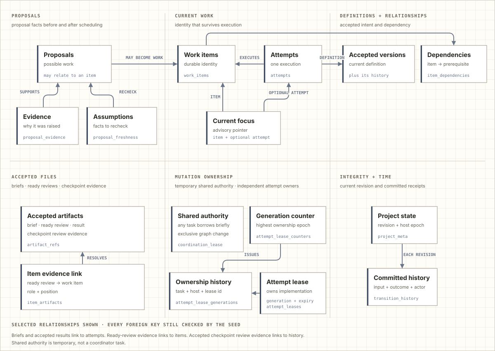

<!-- Generated by docs.how_it_works from executable seeds. Do not edit this file directly. -->
<!-- Reviewed source revision: 7c05482d4cc002ea -->

# How Pinboard works

Pinboard keeps repository work coherent across tasks and interruptions. It preserves what the project decided, which execution is acting on it, who may change it now, and what evidence another task can trust later.

The four views move from the work-item lifecycle to package responsibilities, then follow one change and show the durable relationships underneath.

## What moves

A work item is the durable project decision. An attempt is one execution of that work. They move together while remaining separate: an item can survive interruption, correction, or a replacement worker without losing its identity or accepted scope.

<picture>
  <source media="(prefers-color-scheme: dark)" srcset="assets/how-it-works/product-dark.svg">
  
</picture>

The primary path is intentionally familiar: intake becomes ready, active work enters review, and accepted work becomes a terminal outcome. Deferred, paused, and blocked work are optional branches rather than required stages. Review can request correction, pause at an accepted checkpoint, accept the candidate and continue the attempt, or complete it. Completion can also be accepted directly from active work.

Resume restores paused or blocked work: a retained attempt becomes active, while an item without one becomes ready. Reopen returns deferred work to intake with new evidence. Continue is advisory: it confirms that an already-active attempt proceeds without changing lifecycle state or accepting mutation input.

Proposals and dependencies are not extra states. Accepted scope is the exact authorized revision an attempt uses. Mutation ownership records who may act now: one graph-wide coordination holder, one ready-item preparation claim, or one active-attempt lease. A review candidate identifies the exact result under review, and evidence supports its acceptance.

## What each transition preserves

The lifecycle is accompanied by four guarantees:

- **Work survives conversations.** A later task can continue from accepted scope and evidence instead of reconstructing intent from chat history.
- **Mutation ownership is current.** An expired or replaced worker cannot apply an action it discovered earlier.
- **Review is about one candidate.** Correction, checkpoint acceptance, continuation, and terminal completion preserve different outcomes without changing which work they belong to.
- **Transitions are atomic.** An accepted change updates its related facts and history together; a rejected or failed change leaves the previous ledger intact.

These guarantees explain why seemingly similar words remain distinct.

## Where responsibilities live

The package is split into four layers because each removes a different kind of ambiguity. The split keeps workflow policy out of storage and keeps external representations out of decisions.

<picture>
  <source media="(prefers-color-scheme: dark)" srcset="assets/how-it-works/layers-dark.svg">
  
</picture>

Every arrow in this view means “may depend on”; the next view shows runtime flow. Interfaces absorb the variability of command lines, JSON, project files, and human-readable output. A small exhaustive entry point routes exact commands, while thematic interface modules own composition that needs concrete adapters. Application code reads complete stored state through capabilities and projects an accepted decision into one focused storage mutation. The domain decides legality as pure data. Adapters make accepted facts durable and recoverable. These transformations prevent one layer from silently interpreting facts owned by another.

## Follow one change

Submitting work for review is one visible action, but it strengthens meaning at every boundary. The interface reselects the advertised action, decodes external values against that concrete variant, and produces its exact command without carrying a second general action discriminator into the domain. Advertised command, proposal, and dispatch rejections return as typed failures to one CLI presenter. The application reloads complete current state and mutation ownership inside the write operation. Domain evaluation returns either an accepted change or an expected rejection; rejection leaves the ledger unchanged. The application projects an accepted decision, its receipt, and its affected auxiliary values into a focused storage mutation. SQLite applies only those guarded relational changes. A stale guard returns an expected failure, while infrastructure or programming failures remain exceptions; every unsuccessful path rolls back the transaction without changing the prior ledger.

<picture>
  <source media="(prefers-color-scheme: dark)" srcset="assets/how-it-works/journey-dark.svg">
  
</picture>

The layers do not repeat the same decision. Each contributes a different guarantee, then hands a narrower value to the next owner. Generated views refresh after the authoritative commit and can be rebuilt from the ledger if that refresh is interrupted.

## The durable memory underneath

The relational ledger groups eighteen tables into six kinds of memory: current work, accepted scope and dependencies, discoveries, immutable knowledge, changing mutation ownership, and the history that connects them.

<picture>
  <source media="(prefers-color-scheme: dark)" srcset="assets/how-it-works/database-dark.svg">
  
</picture>

A work item survives attempts. Accepted versions preserve current scope and its revision history. Proposal evidence records why possible work was raised, while its freshness assumptions record which facts must be checked again.

Pinboard publishes immutable artifacts along three current paths. A canonical work brief is published before an item is activated or resumed. The attempt selects that brief, and dispatch later resolves its accepted reference and verifies the exact bytes. Independent ready-review evidence can be published during dispatch preparation, then verified and reused by exact identity.

Checkpoint acceptance publishes the exact result and independent review as immutable artifacts. It then atomically records the result on the attempt, the review on the accepted history receipt, the lifecycle change, and the single receipt. Publication alone does not change lifecycle state; a rejected or rolled-back acceptance leaves the prior ledger relationships intact.

Mutation ownership has three scopes. Shared-change authority is temporary: any task may borrow the single coordination lease for one shared scheduling or graph-wide change, then release it. A preparation claim keeps an item ready while one task compiles and reviews its exact definition-bound brief; activation consumes that claim atomically when it creates the attempt. An attempt lease records which task session—identified by task, host, and lease id—owns one implementation attempt. Generations fence older preparation and attempt owners after transfer or revocation, while unrelated item-scoped leases remain independent. Project state holds the current revision, and committed history records each accepted input, outcome, and actor.

For installation and the product story, return to the [README](README.md). For contributor-facing ownership, storage boundaries, and representative command flows, continue to the [architecture map](ARCHITECTURE.md). The [design principles](DESIGN_PRINCIPLES.md) explain the method used to keep those boundaries explicit.

---

This guide and its SVG diagrams are generated from the executable seeds in <code>docs/how_it_works/</code>. The repository check requires their committed outputs to match current workflow, architecture, journey, and schema authorities.
