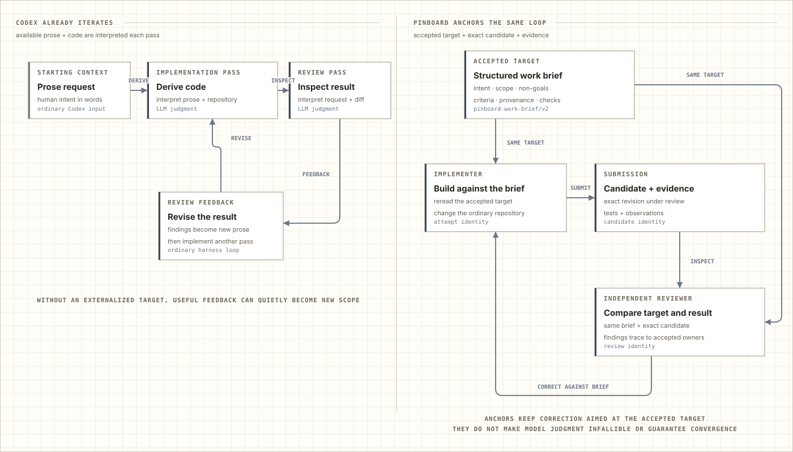
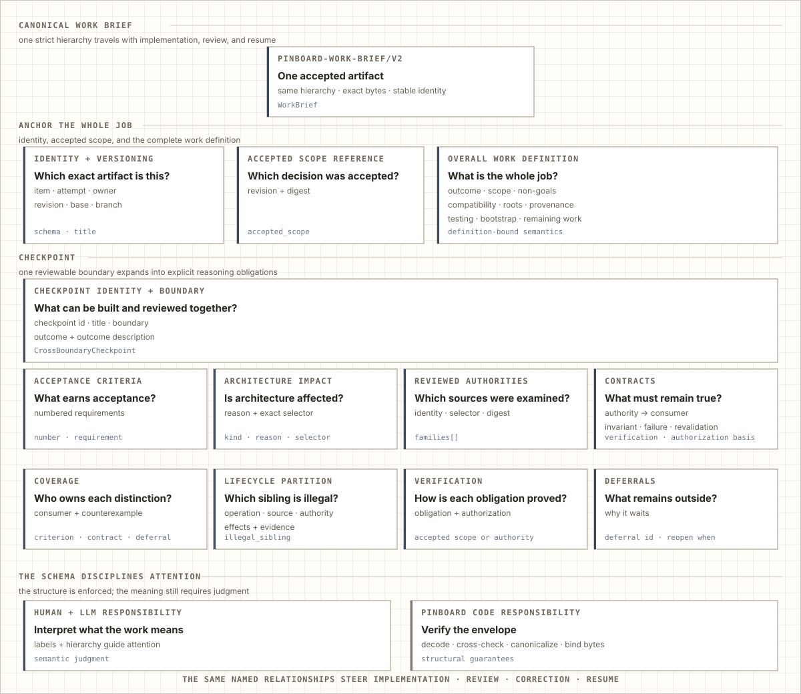
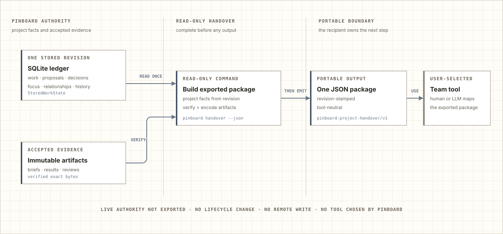

<!-- Generated by docs.how_it_works from executable seeds. Do not edit this file directly. -->

# How Pinboard works

Pinboard adds one repository-local ledger of proposals, accepted work, attempts, and evidence to long-running Codex work. It preserves what the human requested, what an agent proposed, what the project accepted, which execution is acting on it, and what evidence a reviewer can trust later.

For one short, isolated change, Codex already supplies the planning, implementation, testing, and review loop. Pinboard adds deliberate steps when the project must remain coherent across discoveries, parallel tasks, interruptions, and later iterations.

## The workflow before the model

The practical path is short enough to tell without the data model:

1. **Preserve a discovery.** Intake records its trigger, evidence, hypothesis, and likely effect without changing current priority or adding it to the active feature.
2. **Accept exact work.** Coordination decides which proposal belongs in the product, records the complete current definition, and keeps unaccepted ideas visibly separate.
3. **Prepare the brief.** A renewable preparation claim reserves that exact ready definition while one canonical brief is compiled and reviewed. The item does not become active yet.
4. **Implement that brief.** Activation binds the accepted brief to one attempt. The worker claims the attempt, rereads the brief, and changes the ordinary repository in its assigned checkout.
5. **Submit one candidate.** The worker records the exact candidate and its evidence. Submission protects that identity instead of asking review to infer what changed from the latest files.
6. **Review the same decision.** A separate Codex reviewer compares that candidate with the same accepted brief and returns it for correction, accepts a checkpoint, continues the attempt, or completes the work.
7. **Recover without retelling.** Pause and block preserve the attempt and its evidence. Resume requires a brief matching the current definition, so a later task cannot quietly continue obsolete scope.

This normally takes more turns than asking Codex to implement and review a prompt directly. The extra work is the mechanism: discoveries remain proposals, implementation rereads accepted scope, and review receives the exact brief and candidate. Pinboard trades first-delivery speed for a durable boundary between the product you accepted and the plausible additions an agent could otherwise accumulate.

## The loop Codex already provides

A coding harness turns prose into code through interpretation. An implementer reads the request and repository, produces a change, and a reviewer interprets the request and result again. Review findings become new prose for another implementation pass. Codex already supplies this productive back-and-forth.

When the only shared target is the evolving conversation and latest diff, each pass can give new weight to an implementation detail or useful reviewer suggestion. That does not make every untracked loop drift. The risk grows when work crosses more turns, tasks, interruptions, and adjacent discoveries.

<picture>
  <source media="(prefers-color-scheme: dark)" srcset="assets/how-it-works/review-loop-dark.svg">
  
</picture>

Pinboard gives both sides a stable reference. The implementer rereads the accepted brief, submits one exact candidate with evidence, and a separate reviewer receives that same brief and candidate. Correction returns to the same attempt, with blocking findings tied to accepted scope, criteria, or reviewed project authority. The loop still depends on LLM and human judgment and can still be wrong; its corrections remain aimed at an explicit accepted target instead of whatever prose happens to be most recent.

## Strict shape, semantic judgment

The canonical work brief is strict JSON and the sole semantic brief. Unknown fields are rejected. Required sections, accepted-scope identity, authority references, acceptance-criterion references, coverage, and artifact bytes are checked before the brief can travel with an attempt. Most of the brief is still prose: its labels and hierarchy keep different reasoning jobs visible to the human and the LLM.

<picture>
  <source media="(prefers-color-scheme: dark)" srcset="assets/how-it-works/brief-dark.svg">
  
</picture>

The validator cannot prove that prose under `scope` is truly in scope or that a `non_goals` entry expresses the human's intent. The model interprets those meanings, the human accepts the product decision, and independent review challenges the compiled result. The schema disciplines an LLM by making the distinctions difficult to omit and stable across stages, while leaving semantic judgment where it belongs.

The same boundary applies to project impact. Pinboard has no rule saying that a visitor-facing decision must also change a workflow guide or a durable design principle. The structured scope, provenance, reviewed authorities, and coverage let Codex reason from new prose to the project surfaces that appear to be affected without a hard-coded file map or an exhaustive reread of every file. The model can still miss or invent a connection; human acceptance and independent review decide whether the proposed relationship is real. This is information architecture refined through experience, not a semantic consistency engine.

The rest of this guide explains the lifecycle behind that workflow, follows one stored change, shows temporary shared authority and read-only handover, then ends with the relational memory and package responsibilities underneath.

## What moves

A work item is the durable project decision. An attempt is one execution of that work. They move together while remaining separate: an item can survive interruption, correction, or a replacement worker without losing its identity or accepted scope.

<picture>
  <source media="(prefers-color-scheme: dark)" srcset="assets/how-it-works/product-dark.svg">
  
</picture>

The primary path is intentionally familiar: intake becomes ready, active work enters review, and accepted work becomes a terminal outcome. Deferred, paused, and blocked work are optional branches rather than required stages. Review can request correction, pause at an accepted checkpoint, accept the candidate and continue the attempt, or complete it. Completion can also be accepted directly from active work.

Resume restores paused or blocked work: a retained attempt becomes active, while an item without one becomes ready. Reopen returns deferred work to intake with new evidence. Continue is advisory: it confirms that an already-active attempt proceeds without changing lifecycle state or accepting mutation input. The action record's stable `effect` field makes this same lifecycle distinction; it does not claim that a wider command such as dispatch performs no artifact I/O. Dispatch can publish or reuse review evidence while leaving item and attempt lifecycle unchanged.

Proposals and dependencies are not extra states. Proposal intake stores the original proposal facts and creates same-identity `intake` work immediately. Accept keeps that item and applies its selected work details; merge supersedes it in favor of another item; return keeps it in intake and exposes the reason as clarification; reject drops it. Accepted scope is the exact authorized revision an attempt uses. Mutation ownership records who may act now: one graph-wide coordination holder, one ready-item preparation claim, or one active-attempt lease. A review candidate identifies the exact result under review, and evidence supports its acceptance.

## What each transition preserves

The lifecycle is accompanied by four guarantees:

- **Work survives conversations.** A later task can continue from accepted scope and evidence instead of reconstructing intent from chat history.
- **Mutation ownership is current.** An expired or replaced worker cannot apply an action it discovered earlier.
- **Review is about one candidate.** Correction, checkpoint acceptance, continuation, and terminal completion preserve different outcomes without changing which work they belong to.
- **Each authoritative change is atomic.** An accepted change updates its related facts and history together; a rejected or failed change leaves the previous ledger intact.

These guarantees explain why seemingly similar words remain distinct.

## Read, validate, initialize, and repair

Installed inspection commands repeat one short read-only story. The command line decodes one exact leaf, root resolution selects the source checkout, shared repository, and work directory, and the interface samples time when lease expiry matters. It then reads one complete SQLite snapshot, asks application code to project the requested status, overview, item, definition, history, action, or parallel view, and presents that result. These commands neither refresh generated files nor change authority. `input-contract` is deliberately different: it describes static action semantics and payload shape from the selected action kind without opening project state.

`status` is a bounded summary of that one current SQLite snapshot; it is not the full integrity check. `validate` reads one snapshot, reads and verifies accepted brief content needed to derive attempt views, verifies every accepted artifact against its recorded identity, and then compares every replaceable generated view with the bytes that snapshot should produce. Authoritative defects are errors. Missing or stale generated views are warnings because SQLite and accepted artifacts remain the source of truth. Validation only reports; `views rebuild` separately reads one snapshot and verified brief content, derives every expected queue, focus, item, attempt, and history view, and replaces those projections.

Initialization begins with the same explicit roots and one operation time. For the default work directory it records the repository-local Git exclusion. A new ledger is built and verified in a staging file before atomic publication. A returning ledger is schema-checked before Pinboard reconciles only its own same-file publication residue and ensures its directories. Both routes then read the current snapshot, verify accepted brief content, rebuild all generated views, and present the initialization receipt. If view rebuilding fails after database publication, the command reports failure while the authoritative database remains available for a later retry. Only after a successful first initialization, the outer interface may read the user Codex config and recommend one optional long-task default when that setting is absent. It never writes configuration or claims the recommendation is the effective project setting: trusted project configuration may override it. Reopen, failure, and unreadable or malformed user-config paths stay quiet.

Reviewed source planning is another read-only path. `brief-sources` reads one strict manifest, selects whole files or unique Markdown headings from the chosen source checkout, normalizes heading-selected text, rejects overlaps and oversized lines, assigns every selected byte to one ordered segment and batch, and then presents either the complete plan or exactly one requested batch. It never opens the work ledger or edits the project.

## Follow one change

Acquiring a preparation claim shows one complete changing-command story. The command-line boundary first decodes an exact acquisition command. The preparation interface observes stored context, then resolves the caller's supplied coordination claim and requested lease details into one requested preparation change. This observation can explain an absent claim, but it is not the authoritative state used to approve the change.

The application opens the write transaction and rereads locked current state. A pure domain decision returns either an accepted authority change or an expected rejection. Rejection leaves the previous ledger intact. The application projects an accepted decision into one focused mutation, and SQLite commits only those guarded facts and returns that mutation's exact history and project revision. A stale guard returns an expected failure; infrastructure or programming failures remain exceptions; every unsuccessful transaction rolls back.

<picture>
  <source media="(prefers-color-scheme: dark)" srcset="assets/how-it-works/journey-dark.svg">
  
</picture>

After the authoritative commit, the interface refreshes replaceable views. An interrupted refresh can warn without undoing the successful ledger change because the views can be rebuilt. Authority commands then reload the latest state to present the lease that now exists; transition commands present the exact project revision returned by their own commit, even if another writer advances the ledger before presentation. The representative code repeats these verbs and provenance distinctions directly: observed state becomes a requested change; the application owns locked state, accepted decision, focused mutation, and commit; refresh and presentation happen afterward.

## Borrow coordination for one shared change

Some installed commands need temporary graph-wide authority without becoming its long-term owner. Close first builds its transition payload. Item revision first reads and validates the complete proposed definition. Coordination apply first reads the supplied bytes. Each then enters the same borrowed-coordination sequence.

The transition interface observes stored state and requests a temporary coordination acquisition. That acquisition is one authoritative SQLite transaction. If it is rejected, the command stops without cleanup. After a successful acquisition, the interface rereads the retained lease, discovers the currently legal coordinator actions, selects the exact requested action, and only then decodes its matching payload. The selected product transition is decided and committed in a second, separately atomic transaction.

The interface then attempts to release the borrowed lease in a third transaction, whether the product transition succeeded, returned an expected rejection, or raised an exception. These three changes are not one transaction, and release is not guaranteed. A release failure after a successful product transition leaves that transition committed, identifies its revision, and can leave the temporary lease active. When an expected transition rejection and release both fail, the release failure is reported with the original rejection. When the transition raises unexpectedly, that exception remains primary and any cleanup rejection or exception is attached as a note.

Only a successful product transition followed by a successful release reaches the full generated-view rebuild. A rebuild warning is repairable: both authoritative commits remain stored, and `pinboard views rebuild` can recreate the files. The command presents the product-transition revision, not the later release revision.

## Carry the project into another tool

Local continuity and external handover are different jobs. `pinboard handover --json` captures one ledger revision, projects the supported project facts from it, verifies every referenced accepted artifact against its recorded identity and bytes, and emits one revision-stamped portable JSON package only after the exported package is ready.

<picture>
  <source media="(prefers-color-scheme: dark)" srcset="assets/how-it-works/handover-dark.svg">
  
</picture>

The package carries admitted work, focus, accepted definitions, attempts, pending proposals, relationships, decisions, and accepted evidence without choosing how another system represents them. Live coordination, preparation claims, attempt leases, and their generations remain in Pinboard and are not exported. Handover changes no Pinboard state and does not choose or write to the receiving tool; a human or another tool owns that mapping.

## The durable memory underneath

The relational ledger groups eighteen tables into six kinds of memory: current work, accepted scope and dependencies, discoveries, immutable knowledge, changing mutation ownership, and the history that connects them.

<picture>
  <source media="(prefers-color-scheme: dark)" srcset="assets/how-it-works/database-dark.svg">
  
</picture>

A work item survives attempts. Accepted versions preserve current scope and its revision history. Proposal evidence records why intake work was raised, while its freshness assumptions record which facts must be checked again. The original proposal facts remain attached to that work while disposition columns record the later accept, merge, return, or reject decision.

Pinboard publishes immutable artifacts along three current paths. A canonical work brief is published before an item is activated or resumed. Brief publication reads the selected candidate, strictly decodes and cross-validates it, canonicalizes its bytes, publishes the immutable file, accepts its reference in SQLite, rebuilds generated views, and presents the stable accepted reference. The attempt selects that accepted brief.

Dispatch preparation reads the strict environment and any optional prompt or review files, selects the exact current action, resolves and verifies the accepted brief, validates its complete identity and reviewed sources, chooses the local, existing-review, or new-review path, publishes or reuses review evidence, renders the exact prompt, rechecks authority, and only then emits it. Independent ready-review evidence can be published during dispatch preparation and then reused by exact identity. Dispatch prepares a prompt; it does not create a task. Declared permissions are forwarded to the worker as coordinator declarations rather than granted or enforced by Pinboard.

Checkpoint acceptance publishes the exact result and independent review as immutable artifacts. It then atomically records the result on the attempt, the review on the accepted history receipt, the lifecycle change, and the single receipt. Publication alone does not change lifecycle state; a rejected or rolled-back acceptance leaves the prior ledger relationships intact.

Mutation ownership has three scopes. Shared-change authority is temporary: any task may borrow the single coordination lease for one shared scheduling or graph-wide change, then release it. A preparation claim keeps an item ready while one task compiles and reviews its exact definition-bound brief; activation consumes that claim atomically when it creates the attempt. An attempt lease records which task session—identified by task, host, and lease id—owns one implementation attempt. Generations fence older preparation and attempt owners after transfer or revocation, while unrelated item-scoped leases remain independent. Project state holds the current revision, and committed history records each accepted input, outcome, and actor.

## Where responsibilities live

The package is split into four layers because each removes a different kind of ambiguity. The split keeps workflow policy out of storage and keeps external representations out of decisions.

<picture>
  <source media="(prefers-color-scheme: dark)" srcset="assets/how-it-works/layers-dark.svg">
  
</picture>

Every arrow in this view means “may depend on.” Interfaces absorb the variability of command lines, JSON, project files, and human-readable output. A small exhaustive entry point routes exact commands, while thematic interface modules own composition that needs concrete adapters. Application code reads complete stored state through capabilities and projects an accepted decision into one focused storage mutation. The domain decides legality as pure data. Adapters make accepted facts durable and recoverable. These transformations prevent one layer from silently interpreting facts owned by another.

For installation and the product story, return to the [README](README.md). For contributor-facing ownership, storage boundaries, and representative command flows, continue to the [architecture map](ARCHITECTURE.md). The [design principles](DESIGN_PRINCIPLES.md) explain the method used to keep those boundaries explicit.

---

This guide and its SVG diagrams are generated from the executable seeds in <code>docs/how_it_works/</code>. The repository check proves that committed output is fresh and that the specific source relationships encoded by those seeds still hold.
