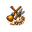

# Pinboard

[](https://github.com/valsteen/pinboard/actions/workflows/ci.yml)
[](https://www.python.org/downloads/)
[](https://docs.astral.sh/uv/)
[](LICENSE)


Pinboard is a repository-scoped planning and execution control plane for coding agents. It turns shared project work into executable state: project decisions, legal next work, current ownership, accepted scope, and acceptance evidence remain durable across tasks and interruptions.

Prompts express one agent's intent. Pinboard records what the project has actually decided and enforces which state changes are legal, so a finding can survive the chat that discovered it and an implementation can reach another task without its brief being retold. It keeps one trustworthy quest log and one trustworthy execution brief without deciding the product for you.

Pinboard is most useful when repository work lasts for days, several Codex tasks are involved, or one change keeps uncovering prerequisites. A short isolated change probably does not need it. [Install it from GitHub](#install-from-github), or follow the campaign below to see the shipped workflow.

## Ashfall Keep becomes a campaign

Imagine you are building *Ashfall Keep*, a small action RPG. One Codex task is working on the dragon boss's second phase. Two scouts return with useful but distracting discoveries: save games capture temporary animation state, and controller mappings identify abilities by inventory position.

Without shared project state, the original chat becomes an accidental backlog, useful conclusions disappear into old conversations, and a feature branch slowly turns into a migration branch. Pinboard gives each discovery an explicit place and keeps the dragon work moving until evidence says it cannot.

 **A quest is discovered.** The scout invokes `$pinboard-intake` to preserve the save-game finding as a visible intake candidate. It appears at the back of the live queue by default, while the current focus and active work remain unchanged. A coordinating chat later decides whether to mark it ready, defer it, merge it, or close it.

 **The map fills in as the party travels.** The proposal keeps the exact trigger, evidence, consequence, and relationship to current work. The receipt stays compact:

> **Saved for later — the animation-state finding is now in `save-game-animation-state` (`intake`); dragon work continues.**

If a task was not authorized to preserve a new concern, it says so and asks for the decision instead of implying that the concern is already tracked. Completed work ends differently—`Completed; no follow-up needed`—so a solved quest never returns as invented backlog.

 **A glance at the quest log stays a glance.** Ask `$pinboard` where things stand and it reads one revision-stamped live overview: the dragon phase is active, controller mapping is ready, and the save-game finding is still in intake. Deeper rationale, completed decisions, delivery checks, or full history are fetched only when you ask for them.

 **An old quest leaves the live map cleanly.** For a conclusive terminal decision on non-active work, `$pinboard` uses `pinboard close` once. It does not invent an intake, activation, expedition, and completion sequence merely to retire the quest; the reason remains in history.

 **Old trails are cleared to the roots.** Repeated revisions can leave stale handlers, test-only APIs, obsolete names, and orphaned tooling behind. Invoke `$slop-cleanup` for a recursive campaign: trace candidates back to current product authority and production roots, remove one approved family, follow the newly orphaned code, tests, documentation, dependencies, and build paths, then repeat until a fresh full pass finds nothing new.


 **The party can split without walking into the same trap.** Ask `$pinboard` which quests can move together. `pinboard parallel preview` identifies a safe group and explains blocked dependencies without creating tasks. Before each selected launch, Pinboard checks the remaining group again; changed ownership or dependencies stop the affected launch with a precise partial result.

 **The party makes camp.** If stable ability IDs become a true prerequisite, `$pinboard` records where the dragon work stopped and what must change. After the prerequisite is accepted, the same attempt can resume from preserved evidence instead of reconstructing the journey.

 **The feature moves again.** `$pinboard` prepares one canonical accepted brief and `pinboard dispatch` points the worker to it without copying its semantics into another prompt. `$pinboard-deliver` claims that one active attempt, follows its exact scope and checks, and returns a durable result for independent review. The coordinating chat accepts the evidence or returns the same attempt for correction; a worker never accepts its own quest.

Everything remains ordinary repository work: code, branches, worktrees, Markdown, and conversation. Pinboard makes the work surrounding it executable and reviewable.

The generated [How Pinboard works](HOW_IT_WORKS.md) guide shows the workflow, package layers, one transition across those layers, and the relational ledger underneath them.

## What Pinboard keeps coherent

- `$pinboard` reads the live map, explains legal next work, previews safe parallel work, and briefly borrows coordination when a shared decision must change.
- `$pinboard-intake` lets any authorized task preserve one finding as visible intake without silently making it ready or active.
- `$pinboard-deliver` executes one accepted attempt from its canonical brief and leaves verification evidence for independent review.
- `$slop-cleanup` traces abandoned or repeatedly revised feature residue to provenance and production reachability, then recurses to a documented fixed point.
- `pinboard` validates and updates the repository-local ledger, rejects stale actions, and keeps unrelated attempt ownership independent.

There is no permanent master chat. One chat can plan and execute sequentially, or several chats can each claim a distinct attempt. Shared scheduling changes use a short exclusive coordination lease; implementation work uses attempt-specific leases, so unrelated changes do not invalidate one another.

The project stores its private working state in ignored local files:

```text
.codex/pinboard/
  state.sqlite3               # authoritative lifecycle, dependencies, leases, and history
  artifacts/                  # immutable briefs, evidence, proposals, and reviews
  views/                      # generated human-readable projections
```

SQLite is the sole current ledger authority. Immutable artifacts retain long-form contracts and evidence; generated views are convenient projections, never fallback state. The [architecture map](ARCHITECTURE.md) explains the package layers, persistence boundaries, failure semantics, and representative command flows.

## Install from GitHub

The plugin currently supports macOS and Linux. It uses [uv](https://docs.astral.sh/uv/) to provide its Python 3.14 runtime and installed command.

Add this repository as a Codex marketplace, then install the plugin:

```sh
codex plugin marketplace add valsteen/pinboard
codex plugin add pinboard@pinboard
```

Start a Codex task in the repository and ask:

> Set up the pinboard here and explain how I can use it from one chat or several chats.

When another task uncovers something worth keeping, ask it:

> Add this to the repository work queue as intake: saving a boss fight currently captures temporary animation state. Include what you found and why it could block phase-two save support.

For a quick current picture, ask:

> Give me the quick live-work overview. Then offer the deeper views I can ask for.

## Runtime and development

The package targets Python 3.14 only. msgspec provides immutable records and strict JSON decoding at repository boundaries. uv manages Python installation, the project environment, dependencies, the checked-in lockfile, and command execution.

```sh
uv sync --locked
uv run --locked ruff format --check .
uv run --locked ruff check .
uv run --locked pyrefly check
uv run --locked pyrefly coverage check src --strict --fail-under 100
uv run --locked coverage run -m unittest discover -v
uv run --locked coverage report
uv run --locked python scripts/validate-metadata.py
uv run --locked python -m docs.how_it_works.render --check
uv build --no-sources
scripts/pinboard --help
```

Local checks, CI, and the plugin launcher all use the package installed by uv. The checked-in uv lockfile is the single development dependency record. CI validates the plugin and its skills before the repository is published.
