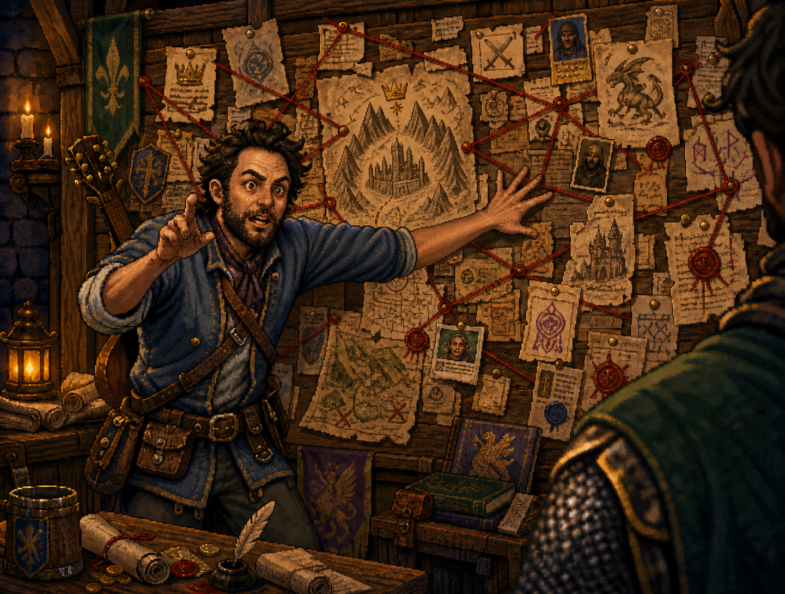
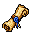
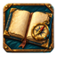
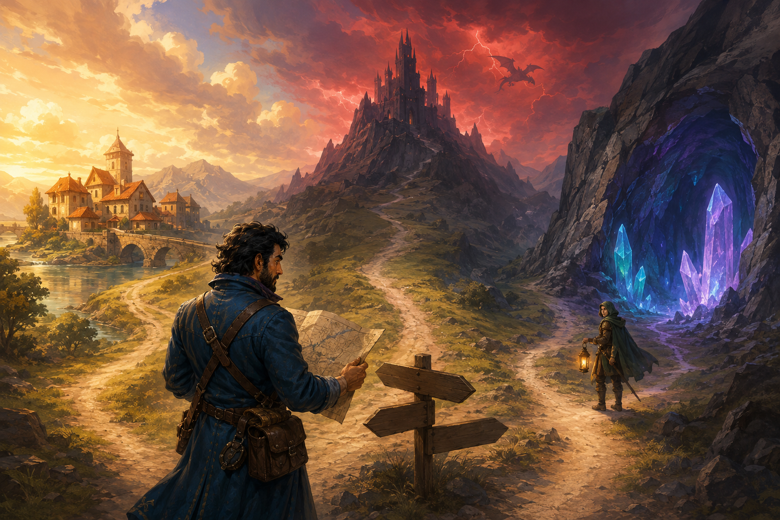
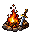
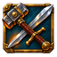

# Charlie's pinboard

[](https://github.com/valsteen/charlie-pinboard/actions/workflows/ci.yml)
[](https://www.python.org/downloads/)
[](https://docs.astral.sh/uv/)
[](LICENSE)



Keep one trustworthy quest log—and one trustworthy execution brief—while several Codex tasks explore and build in the same repository.

Charlie's pinboard helps when a feature stops being a straight line. Side tasks can bring back useful discoveries without turning every chat transcript, topic folder, or feature branch into another backlog. When a piece of work is ready, the pinboard keeps its scope and checks intact from planning through implementation and review.

The pinboard preserves what the party learns, keeps the available paths visible, and carries each chosen piece of work into one trustworthy execution brief without deciding the product for you.

## An indie RPG feature becomes a campaign

Imagine you are building *Ashfall Keep*, a small action RPG. One Codex task is working on the dragon boss's second phase. While tracing the combat code, you open two other tasks: one finds that save games capture temporary animation state, while the other discovers that controller mappings identify abilities by their inventory position.

All of that is worth keeping, but not all of it should derail the boss feature. Without one shared place for the work, the original task becomes an accidental backlog, useful conclusions disappear into old conversations, and a feature branch slowly turns into a migration branch.

 **A quest is discovered.** A side task comes back with a warning: “Before we can save the second phase safely, combat abilities need IDs that won’t change underneath us.” The proposal stays in the shared inbox until any chat briefly borrows coordination authority and reviews it; the work list does not change behind your back.

 **The map fills in as the party travels.** Deep work rarely reveals the whole campaign upfront. While the dragon fight remains the main quest, an experiment may reveal that save games are capturing temporary animation state, a flaw worth returning to later. The pinboard lets the plan grow from that evidence without turning every discovery into an interruption: preserve the exact finding, keep the current objective moving when it is not blocked, and leave one compact receipt.

> **Saved for later — the animation-state finding is now in `save-game-animation-state` (`intake`); dragon work continues.**

That line is small on purpose. It removes the anxiety that a valuable observation vanished into conversation while keeping the discussion centered on the work in front of you. Over a long investigation, those receipts let the project adapt its plan as reality becomes clearer without reconstructing the journey from old chats.

Another scout may return with a concern that nobody authorized as a new quest. The chat does not wave it away with “not recorded” and leave you wondering whether to react:

> **Finding needs a decision — controller profiles may also depend on inventory position, but that concern is not saved because this task was not authorized to add it. The dragon work can continue. Should I preserve it for later or dismiss it?**

If the ledger changes while the finding is being saved, the task retries that expected coordination conflict itself. If the proposal reaches the inbox but the coordinating chat cannot be notified, the receipt still says it was saved and that no action is needed. Completed work gets a different ending—`Completed; no follow-up needed`—so a solved quest never masquerades as a newly discovered one.

 **A glance at the quest log stays a glance.** You ask, “Where do we stand?” and the chat reads the live map once: the dragon phase is active, controller mapping is ready, and the save-game finding is still in intake. It answers with that compact picture, then asks naturally whether you want to know why one quest should come next, which decisions are already finished, whether a branch shipped, or how the full campaign unfolded. You can answer with a normal sentence, a short phrase, or the number beside an offered continuation. These are conversational doors with optional shortcuts, not magic global commands. Until you choose one, the chat does not rummage through old chronicles or ride to GitHub just in case.

 **An old quest leaves the live map cleanly.** When you decide an old research quest is conclusively unnecessary, the chat records that terminal decision in one move. It does not pretend the quest returned to intake, became ready, started an expedition, and completed an invented attempt. The revision-stamped receipt is enough to know the quest left the live map and its reason remains in history.



 **The party can split up without walking into the same trap.** Before launching anything, you ask which quests can move together. The preview puts save-game animation research and controller-remapping research in the safe group, and explains that a dragon-arena integration still depends on the boss work. Merely looking at that map creates no new tasks.

You can select a few quests or say, “Launch all safe work.” The animation question still needs design choices, so it opens as a visible task where you can inspect the work and answer questions. The controller investigation already has a complete autonomous brief, so a subagent can scout it quietly and return evidence. Before each launch, the remaining group is checked again; if another task takes ownership of an attempt or changes a dependency, the rest stop with a precise partial result instead of pretending the whole party departed.

 **The party makes camp.** The chat making the scheduling change briefly acquires coordination, records that stable ability IDs come first, then releases it. The dragon task notes exactly where it stopped and what needs to happen before it can pick the feature back up.

 **The feature moves again.** Another task fixes the ability IDs, then the dragon task continues from its notes. If an older task tries to update a work list that has since changed, `pinboard` asks it to catch up first.

Everything stays ordinary repository work: code, branches, worktrees, Markdown, and conversation. The plugin keeps the work list coherent and gives each implementation one canonical brief, so the task a worker receives is still the task the coordinating chat meant to send.

## Where it saves rework

You plan a change carefully, hand it to another AI, and get back something that is almost right. One half of a protocol was postponed even though both halves had to move together. The exact test commands became “run the relevant checks.” A request to read one section became a tour of half the repository. After seeing the same mistakes recur, they stop looking random: they happen when the task is retold on its way to the worker.

The pinboard keeps that retelling out of the workflow. The worker goes back to the accepted attempt brief, while the launch message says only where to work and which checkpoint to pick up. When consequential work crosses components, the brief is compiled from exact named architecture or plan sections and independently checked against them before launch. That catches a missing state, consumer, or counterexample while the brief is still cheap to correct. Routine local work keeps the lightweight path. Review still gets the final say, but it should not have to reconstruct the task first.

## What it gives you

- one shared work list for features, bugs, cleanup, and foundation work;
- an inbox where any Codex task can leave something it discovered;
- a canonical attempt brief that survives the trip from planning to implementation;
- enough recorded context and evidence to pause work, resume it, and review it without reconstruction;
- early warnings for stale state, contradictory launch instructions, and incomplete cross-component checkpoints;
- reviewable local project state instead of another hosted service.

It is most useful when repository work lasts for days, several Codex tasks are involved, or one piece of work keeps uncovering prerequisites. A short isolated change probably does not need it.

## Install from GitHub

The plugin currently supports macOS and Linux. It uses [uv](https://docs.astral.sh/uv/) to provide its Python 3.14 runtime and installed command.

Add this repository as a Codex marketplace, then install the plugin:

```sh
codex plugin marketplace add valsteen/charlie-pinboard
codex plugin add charlie-pinboard@charlie-pinboard
```

Start a Codex task in the repository and ask:

> Set up the pinboard here and explain how I can use it from one chat or several chats.

When another task uncovers something worth keeping, ask it:

> Add this to the repository work inbox: saving a boss fight currently captures temporary animation state. Include what you found and why it could block phase-two save support.

In any chat, you can ask what came in, how it relates to work already underway, and what is ready to start. That chat borrows the short coordination lease only for the shared change, then releases it. For example:

> Give me the quick live-work overview. Then offer the deeper views I can ask for.

The first answer deliberately stays on live work. Ask for the recommendation and item context, completed decisions, delivery and CI, or the full history only when that layer is useful. A terminal decision such as “this deferred experiment is complete and we will not return to it” is recorded directly instead of being walked through artificial intermediate states.

## One chat or several

There is no master chat to keep alive. The single-chat workflow remains the simplest option: one chat can inspect the ledger, briefly borrow coordination for scheduling changes, claim its attempt, and finish the work.

For concurrent work, open one chat per distinct outcome. Each chat claims only its own attempt, so unrelated item changes do not invalidate its local actions. A chat that needs to admit work, change dependencies, activate an attempt, or accept a result briefly acquires the exclusive coordination lease and releases it after that atomic change. If another chat already holds coordination, the command identifies that chat and the lease expiry so the current chat can wait or ask you about revocation.

## Core model

Three ideas keep responsibilities clear:

- the shared work list answers what the project may work on next;
- topic folders hold research, designs, plans, and reports;
- branches and worktrees belong to the concrete attempt to implement something.

The project stores its private working state in ignored local files:

```text
.codex/work/
  state.sqlite3               # authoritative lifecycle, dependencies, leases, and history
  artifacts/                  # immutable briefs, evidence, proposals, and reviews
  views/                      # generated human-readable projections
.codex/topics/
```

SQLite is the sole current ledger authority. Immutable artifacts retain long-form evidence and execution contracts, while generated views remain convenient to inspect but never become fallback state. `pinboard` validates the database before changing it, fences expired or revoked owners, refuses updates made from an older relevant view, and prepares worker launches without copying the task semantics into another prompt.

The plugin contains:

- `pinboard`, the primary command that checks and updates the shared state;
- `$pinboard`, which helps any chat explain the current picture, borrow coordination when needed, and choose what happens next;
- `$pinboard-intake`, which lets any task leave a finding for later review;
- `$pinboard-deliver`, which follows one accepted brief and returns evidence for independent review.

## Runtime and development

The package targets Python 3.14 only. msgspec provides the immutable records and strict JSON decoding used at repository boundaries. `.python-version` pins the current stable 3.14 patch release. uv manages Python installation, the project environment, dependencies, the checked-in lockfile, and command execution.

The [architecture map](ARCHITECTURE.md) explains the package layers, SQLite storage boundaries, and representative command flows without requiring readers to reconstruct ownership from imports.

```sh
uv sync --locked
uv run --locked ruff format --check .
uv run --locked ruff check .
uv run --locked pyrefly check
uv run --locked pyrefly coverage check src --strict --fail-under 100
uv run --locked coverage run -m unittest discover -v
uv run --locked coverage report
uv run --locked python scripts/validate-metadata.py
uv build --no-sources
scripts/pinboard --help
```

Local checks, CI, and the plugin launcher all use the package installed by uv. The checked-in uv lockfile is the single development dependency record. Its development group includes the YAML parser used for platform-compatible skill validation; the installed `charlie-pinboard` package does not depend on it.

CI validates the plugin and its skills before the repository is published.
